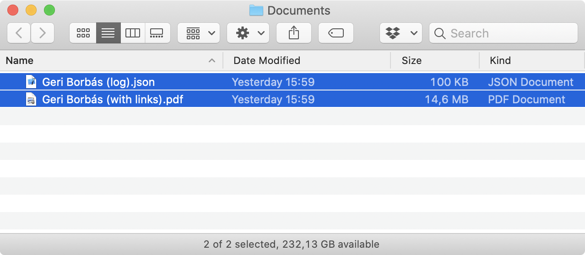

# 📄 `PDF` Links

**Tiny tool helps creating PDF links in Adobe Illustrator.**

A convinient way to create / layout / maintain PDF link annotations right in Adobe Illustrator.

## Usage

Create a layer for the links (that you can hide later on).

Create a text starting with **"Link "** followed by the actual url.
Wrap into a clipping rectangle to define link hotspot.

Turn off layer containing the links.
Launch PDF Links, drag PDF into.

Enjoy linked PDF.

> I left the debug JSON log there for easier troubleshooting if any.

## License

> Licensed under the [**MIT License**](https://en.wikipedia.org/wiki/MIT_License).
