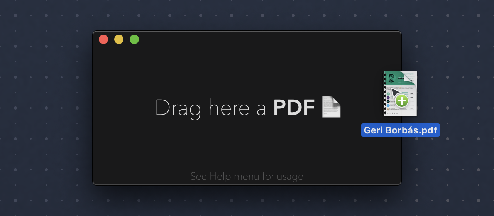

# 📄 `PDF` Links

**A convinient way to create / layout / maintain PDF link annotations in Adobe Illustrator.** 

## Motivation

While you can create automatic links in a PDF (by put the actual url into a textbox), it is limiting in various ways (create links on graphics, create custom hotspot). Also, when iterating on a document design, I found it pretty cumbersome to create / update link annotations in external apps, so after some research on [Apple PDFKit](https://developer.apple.com/documentation/pdfkit) I put together this tiny tool.

## Usage

Create a layer for the links (that you can hide later on).

Create a text starting with **"Link "** followed by the actual url.

Wrap into a clipping rectangle to define link hotspot.

Hide layer containing the links before export PDF.

Launch PDF Links, drag PDF into.

Enjoy linked PDF.

## License

> Licensed under the [**MIT License**](https://en.wikipedia.org/wiki/MIT_License).
